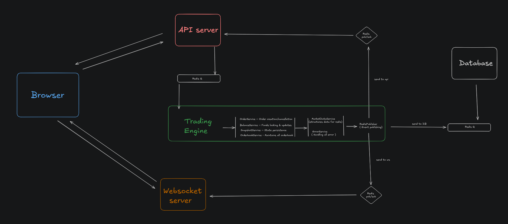

# Crypto Trading Platform

## Brief Overview
A high-performance cryptocurrency trading platform built for low-latency execution and seamless real-time trading. It combines modern frontend frameworks with optimized backend services for an efficient trading experience.

## Tech Stack

* **Frontend:** Next.js (Server Actions + TanStack Query)
* **API Server:** Bun + Hono with Zod validation
* **WebSocket Server:** ws library on Bun runtime
* **Trading Engine:** In-memory orderbook & balances
* **Inter-service Communication:** Redis Queue & Pub/Sub

## Features

* Real-time trading with WebSocket updates
* Low-latency order execution (7-20ms average response)
* Secure API architecture with schema validation
* Scalable service communication using Redis
* Responsive, interactive UI built with Next.js

## Architecture  

# Detailed Overview

## 🛰 API Workflow
The API server acts as a lightweight validation and routing layer. Upon receiving a request:

1. **Validation:** Each request is validated using a **Zod middleware**.
2. **ClientID Assignment:** A unique **ClientID** is generated for the request.
3. **Redis Queue:** The server enqueues the **ClientID + request payload** into a Redis queue.
4. **Redis Pub/Sub Subscription:** Simultaneously, it subscribes to a **Redis Pub/Sub channel** identified by the ClientID.
5. **Response Handling:** Once the response is received on the channel, it is forwarded back to the client.

This pattern reduces computation overhead on the API server, allowing it to focus solely on **validation and message routing**.

## ⚙️ Trading Engine Server
The core component responsible for executing all exchange business logic.

* Built with a **class-based architecture** comprising **7 services**, each with a single responsibility.
* The **Engine class** initializes and injects dependencies for all services. No external instantiations are allowed.
* **Engine** orchestrates message routing to relevant services.
* Core logic handled by: **Order, OrderBook, Balance, Snapshot** services.
* **Error** and **MarketData** services prepare outbound data for Redis.
* A dedicated **Redis Publisher** serves as the single exit point, publishing messages to Pub/Sub channels.

This modular design ensures maintainability and scalability of trading operations.

## 🔌 WebSocket Server (Real-Time Updates)
This server enables real-time data delivery via WebSockets and Redis Pub/Sub.

### Key Components:

* **Connection Pool:** Tracks all active client connections with unique IDs.
* **Client Connection:** Represents individual WebSocket sessions, handling subscriptions.
* **Channel Broker:** Manages Redis Pub/Sub subscriptions, routing published messages to subscribed clients.

### Workflow:

* New connections are added to the **Connection Pool**.
* **Client Connection** registers subscriptions via the **Broker**.
* The **Broker** listens for Redis Pub/Sub messages and dispatches updates to clients.

This architecture ensures efficient and scalable real-time broadcasting.

## 🖥 Frontend (Next.js Client)
The client interface is built with **Next.js**, optimized for performance and real-time interactivity.

* **Server-side Prefetching:** Ticker data is fetched and prefetched on the server.
* **WebSocket Manager Class:** Manages live market data streams.
* Dynamic **subscribe/unsubscribe** behavior ensures only the active market's data is fetched.

### Features:

* Placing orders
* Live market orderbook & ticker
* User's open orders & asset balances
* Kline (candlestick) & ticker visualizations
* Onramping initial assets for users

The frontend architecture ensures a seamless, responsive trading experience while optimizing resource usage.

## 🐳 Docker Setup
Docker is used to run a Redis instance on port 6379 for inter-service queues and Pub/Sub messaging.

---
